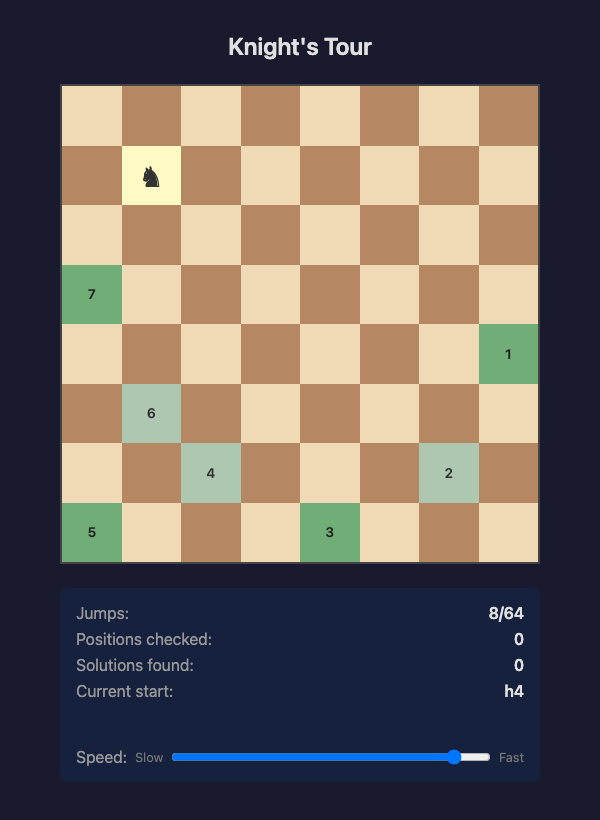
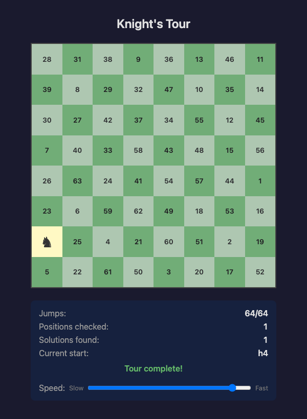

# Knight's Tour

A browser-based visualization of the [Knight's Tour](https://en.wikipedia.org/wiki/Knight%27s_tour) chess problem, solved using **Warnsdorf's heuristic**.

The app automatically attempts a complete knight's tour from every starting position on an 8x8 board, animating each move in real time and tracking statistics along the way.

## Screenshots

| Tour in progress | Completed tour |
|:---:|:---:|
|  |  |

## Features

- **Animated chessboard** -- watch the knight traverse all 64 squares step by step
- **Warnsdorf's heuristic** -- picks the next square with the fewest onward moves, achieving ~99% success rate on 8x8 boards
- **Exhaustive testing** -- cycles through all 64 starting positions in random order
- **Live statistics** -- jumps counter, positions checked, solutions found, current start square
- **Speed slider** -- adjust animation speed from 10 ms to 2000 ms per move

## Prerequisites

- [Node.js](https://nodejs.org/) >= 18

## Getting started

```bash
# Install dependencies
npm install

# Start the development server
npm run dev
```

Then open the URL shown in the terminal (typically `http://localhost:5173`).

## Scripts

| Command | Description |
|---|---|
| `npm run dev` | Start Vite dev server with hot reload |
| `npm run build` | Type-check and build for production |
| `npm run preview` | Preview the production build locally |
| `npm test` | Run tests once |
| `npm run test:watch` | Run tests in watch mode |

## Tech stack

- **TypeScript** -- strict mode, no `any`
- **Vite** -- dev server and bundler
- **Vitest** + **happy-dom** -- unit tests with DOM simulation
- No frameworks -- vanilla TypeScript with direct DOM manipulation

## Project structure

```
src/
  algorithm.ts     Knight move logic and Warnsdorf's heuristic
  board.ts         Chessboard DOM rendering (CSS Grid)
  stats.ts         Statistics panel and speed slider
  controller.ts    Animation loop orchestration
  main.ts          Entry point
  types.ts         Shared types and constants
  *.test.ts        Co-located unit tests
```

## How it works

1. A random permutation of all 64 board positions is generated (Fisher-Yates shuffle).
2. For each starting position, the knight attempts a complete tour using Warnsdorf's rule: at every step it moves to the adjacent square with the fewest remaining valid moves.
3. Each move is animated on the board with a configurable delay. Visited squares turn green and display their move number.
4. After a tour completes or gets stuck, the result is shown and the next starting position begins.

## Built with

This project was scaffolded and developed using [Agentic Orchestration](https://github.com/gbFinch/agentic-orchestration) -- an AI-driven workflow that chains specialized agents (vision, research, architecture, scaffolding, etc.) to go from a project brief to working code.

## License

MIT
